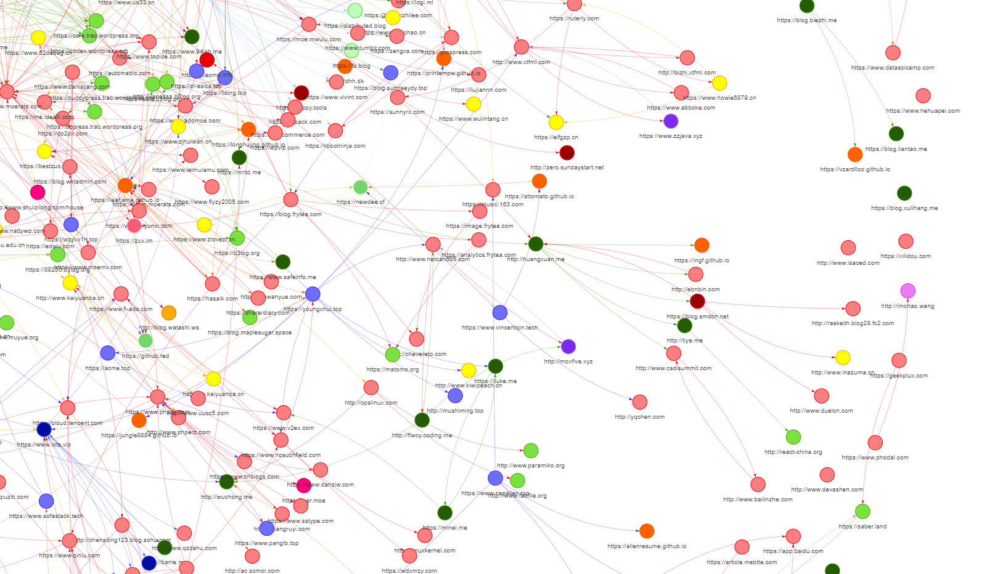

# 中文独立博客调研

抓取中文独立博客数据及其友链关系，绘制成可交互的关系图表。用于探索中文独立博客之间的关联，挖掘有意思的数据。

https://zh-independent-blog-research.netlify.com/



## 获取源码&安装依赖


+ python 3.7+
+ pipenv
+ node 10+
+ yarn

```shell
git clone https://github.com/TNK-Studio/zh-independent-blog-research.git
cd zh-independent-blog-research
pipenv install
cd site
yarn
```

## 运行 

+ 抓取数据
    ```shell
    pipenv run app.py
    ```

+ 合成图数据

    输出 `site/src/data.json` 和 `site/src/graph.json` 供前端使用。

    ```shell
    python get_graph_data.py
    ```
    

+ 构建前端

    ```
    cd site # site 目录下
    yarn start # 运行开发服务器
    yarn build # 构建生产版本
    yarn serve # 本地查看部署的站点（build 后）
    ```

+ 更新数据

    在 site_feature.py 中添加新的 feature ,从保存的 html 中提取新数据
    ```
    pipenv run  python parse_data.py
    ```
    然后重新合成图数据


## 说明

这个项目受启发于 https://github.com/timqian/chinese-independent-blogs 

项目初始阶段为了验证想法，希望依赖尽可能的少。没有引入 redis、数据库等组件。采用单机多进程+协程的方式爬取数据。采用文件系统存储数据。
如果因意外情况崩溃，可以使用下如下命令恢复运行状态，继续爬取。

+ 获取未完成的队列 & 清理数据
    ```
    python clean_data.py
    ```

### 如何判断一个站点是否是中文独立博客

在 `is_site_a_zh_i9t_blog` 中内置了 `is_zh_i9t_blog.pkl` 模型。可以直接使用，如果觉得效果不好，可以自己获取数据，重新训练。

+ 获取训练数据

    从 `is_site_a_zh_i9t_blog` 下的  top100 中文站点, top500 站点，和独立博客列表中获取训练数据。
    会先请求站点获取数据，只用了协程比较慢。

    ```
    python get_data_set.py
    ```

+ 训练&获取模型

    从 `dataset.json` 中获取数据训练，保存为 `is_zh_i9t_blog.pkl`

    ```
    python is_zh_i9t_blog.py
    ```

## 设计思路&Roadmap

更多的细节，参见：https://www.notion.so/55e54db856e343dd847dc207057ee751

